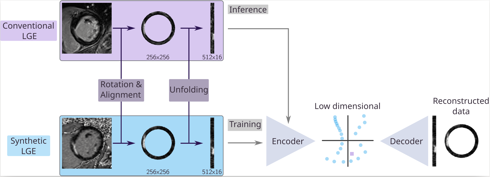
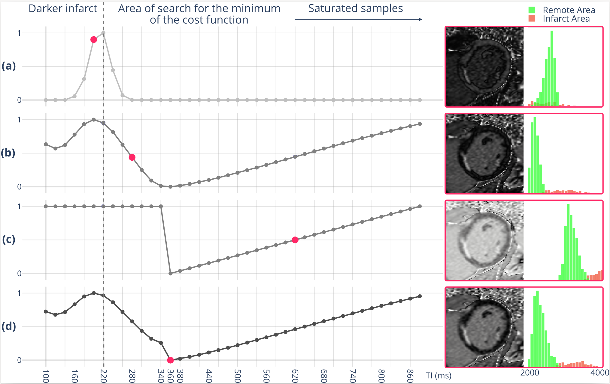
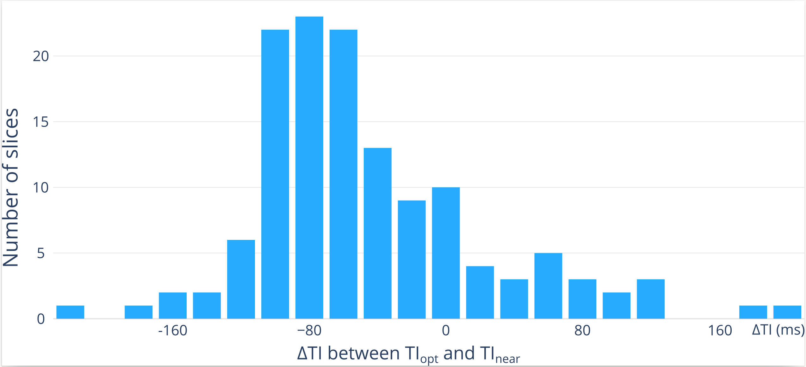

# Comparison of synthetic LGE with optimal inversion time vs. conventional LGE via representation learning: Quantification of Bias in Population Analysis





## Prerequisites
- Python 3.9+


## Installation
- Clone the repository and enter it:
    - git clone <https://github.com/creatis-myriad/TI_selection_and_RL>
    - `cd TI_selection_and_RL/bin/`


## Create the Conda environment
- Create a conda environment from the provided file:
    - conda env create -f environment.yaml
- Activate it:
    - conda activate TI_RL_env


## Data preparation
- Data come from the [MYOSAIQ challenge](https://www.creatis.insa-lyon.fr/Challenge/myosaiq/).
- The D8 subset was not used.


## TI selection
Below is the command line to get the optimal TI from the dicom files of a patient.
- **Get optimal TI**

    ```bash
    python get_TIopt.py \
        --inputDir_Dicom "/directory/of/patients' dicoms " \
        --inputDir_Roi "/directory/of/patients' segmentation masks " \
        --method "std+sat" \
        --option "std" \
        --outputDir "/output/directory"
    ```

- **Visualize optimal TI**
<br> The **Figure 1** from the article was made with the command line below.

    ```bash
    python visu_TIopt.py \
        --load_MAG_dicoms_from_dir '/your/input/dir' 
        --load_T1_roi_file '/your/segmentation/file'
        --load_LGE_file '/your/input/file'
    ```




## How to run the models
Below are the command lines to run the models:
- **VAE**

    ```bash
    python training_VAE.py \
        --inputDir '/your/input/dir' \
        --ref '/the/reference' \
        --outputDir "/your/output/dir" \
        --latent_dim 8 \
        --beta 1 \
        --epoch 80 \
        --LR 5e-4 \
        --split_data 0.15 \
        --dcm 1
    ```

- **ARVAE**

    ```bash
    python training_AR-VAE.py \
        --inputDir '/your/input/dir' \
        --ref '/the/reference' \
        --outputDir "/your/output/dir" \
        --latent_dim 8 \
        --nargs_wloss 2 10 2 20 \
        --epoch 80 \
        --LR 5e-4 \
        --split_data 0.15
    ```

Here is the command line to visualize the histogram (**Figure 6**) and other parameters.
<br> It needs the output from a training, the data that you want to project in the latent space and the file with optimal TIs.

- **Visualization:**

    ```bash
    python visu_FullSeq_MAG.py \
        --input_LS_var 'latent_var_patients.pkl' \
        --load_nn_model 'save_model' \
        --inputDir '/your/input/dir' \
        --data_to_project '/your/data/to/project' \
        --ref 'reference.pkl' \
        --TIopt 'idx_TIopt_MAG_std+sat_std.pkl' \
        --ar_vae 1 \
        --fMAG 1 
    ```




